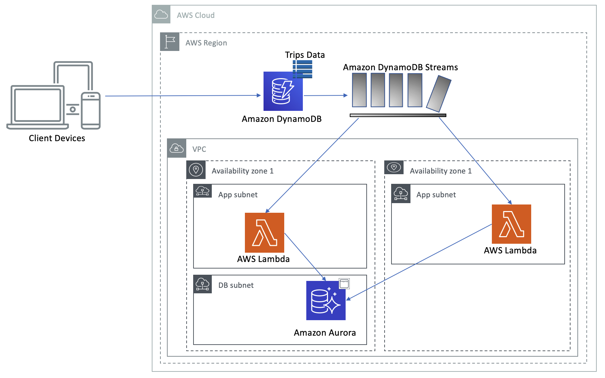

# Lab 2: Simulate Taxi Booking, Billing and Payments using Amazon DynamoDB, DynamoDB Streams, AWS Lambda and Amazon Aurora PostgreSQL

- [Overview](#overview)
- [Prerequisites](#prerequisites)
- [Setup the AWS Cloud 9 Environment](#setup-the-aws-cloud-9-environment)
  * [Update SAM CLI](#update-sam-cli)
  * [Install AWS SDK for Python](#install-aws-sdk-for-python)
  * [Save CloudFormation Stack name as a variable](#save-cloudformation-stack-name-as-a-variable)
- [Enable Amazon DynamoDB Streams](#enable-amazon-dynamodb-streams)
- [Deploying AWS Lambda Function](#deploying-aws-lambda-function)
  * [Packaging the PG8000 binaries](#packaging-the-pg8000-binaries)
  * [Deploy AWS Lambda Function and AWS Lambda Layer using AWS SAM template](#deploy-aws-lambda-function-and-aws-lambda-layer-using-aws-sam-template)
- [Taxi Ride Workflow](#taxi-ride-workflow)
  * [Taxi Trip Booking Workflow](#taxi-trip-booking-workflow)
  * [Driver Billing and Payments](#driver-billing-and-payments)
 
## Overview

In this lab, you will simulate taxi trip booking by a rider and acceptance by a driver followed by billing and payment using Python scripts and SQL commands. You will utilize DynamoDB streams and AWS lambda functions to insert completed trip data from DynamoDB to Aurora PostgreSQL.



## Prerequisites

1. You should have completed [Lab1](https://github.com/aws-samples/amazon-rds-purpose-built-workshop/tree/master/lab1-TaxiDataMigration) from the [github repository](https://github.com/aws-samples/amazon-rds-purpose-built-workshop).

## Setup the AWS Cloud 9 Environment

### Update SAM CLI

1. Open the AWS Management Console for [AWS Cloud9](https://us-east-1.console.aws.amazon.com/cloud9/home/account). You will leverage AWS Cloud9 IDE throughout this lab for running scripts, deploying AWS SAM (Serverless Application Model) templates, executing SQL queries etc.
2. Click on __Open IDE__ for the AWS Cloud9 IDE that was created as part of the Amazon CloudFormation template that was deployed.
3. Open a terminal window in the  AWS Cloud9 IDE by clicking on __Window__ from the menu bar on the top and select __New Terminal__.
4. Update AWS SAM CLI to the latest version by running the following commands in the Cloud9 terminal window.
   
 ```shell script
cd ~/environment
pip install --user --upgrade awscli aws-sam-cli
sam --version
```  
> Note: Ensure that the SAM CLI version is 0.21.0 or above.

### Install AWS SDK for Python

- To install [Boto3](https://boto3.amazonaws.com/v1/documentation/api/latest/index.html?id=docs_gateway) (AWS SDK for Python) copy paste the following commands in the terminal window in the AWS Cloud9 IDE
   
 ```shell script
cd ~/environment
curl -O https://bootstrap.pypa.io/get-pip.py # Get the install script. 
sudo python3 get-pip.py # Install pip.
pip3 install boto3 --user
 ```

### Save CloudFormation Stack name as a variable

1. Open the AWS Management Console for CloudFormation from [here](https://us-east-1.console.aws.amazon.com/cloudformation/home?region=us-east-1).  
2. In the upper-right corner of the AWS Management Console, confirm you are in the US East (N. Virginia) Region.  
3. Click on __Stacks__ in the right navigation pane.
4. Under __Stacks__ copy the parent CloudFormation stack name starting with **mod-** (e.g. _mod-aa8afde9acf04c7f_).
5. Substitute the string (_substitute-name-of-copied-cf-stack-name_) in the command below with the name of the CloudFormation stack and run it in the Cloud9 terminal window.

```shell script
AWSDBWORKSHOP_CFSTACK_NAME="substitute-name-of-copied-cf-stack-name"
```   

6. Copy and paste the following commands in the Cloud9 terminal window to set the environment variable _$AWSDBWORKSHOP_CFSTACK_NAME_ . 

```shell script
echo "export AWSDBWORKSHOP_CFSTACK_NAME=${AWSDBWORKSHOP_CFSTACK_NAME}" >> ~/.bash_profile
. ~/.bash_profile
echo $AWSDBWORKSHOP_CFSTACK_NAME
```   

> Note: Ensure that the name of the CloudFormation stack printed in the terminal window (e.g. _mod-aa8afde9acf04c7f_) matches with the name of your parent CloudFormation stack name.

## Enable Amazon DynamoDB Streams
In this section, you will enable Amazon DynamoDB stream for the Amazon DynamoDB table named _'aws-db-workshop-trips'_ that was created as part of the CloudFormation stack.

- Copy and paste the commands below in the Cloud9 terminal window to enable streams for the Amazon DynamoDB Tables named _'aws-db-workshop-trips'_
```shell script
STREAM_ID=$(aws dynamodb update-table --table-name aws-db-workshop-trips --stream-specification StreamEnabled=true,StreamViewType=NEW_AND_OLD_IMAGES | jq '.TableDescription.LatestStreamArn' | cut -d'/' -f4)
STREAM_NAME=stream/${STREAM_ID::-1}
echo "export AWSDBWORKSHOP_DDB_STREAM_NAME=${STREAM_NAME}" >> ~/.bash_profile
. ~/.bash_profile
echo $AWSDBWORKSHOP_DDB_STREAM_NAME
```

> Note: The output should be similar to the following 
>```
>stream/2019-09-18T20:18:33.343
>```

Now that you have enabled the Amazon DynamoDB stream, the next step is to deploy the AWS Lambda function that will process records from the stream.

## Deploying AWS Lambda Function
In this section, you will be using AWS Serverless Application Model ([SAM]((https://aws.amazon.com/serverless/sam/))) CLI to deploy a Lambda Function within the same Amazon Virtual Private Network([VPC](https://aws.amazon.com/vpc/)). The SAM deployment will also include a Python interface to the PostgreSQL database engine as an AWS Lambda Layer. This Lambda function will read the taxi trip information from DynamoDB streams as they are inserted/updated in the DynamoDB table **_aws-db-workshop-trips_**. Only when a trip is complete (denoted by the _STATUS_ attribute in the trip item/record), the Lambda function will insert information into **_trips_** table in Aurora PostgreSQL. 

### Packaging the PG8000 binaries 

In this section, you will download and package the binaries for [PG8000](https://pypi.org/project/pg8000/) - a Python interface to PostgreSQL. The package will be deployed as an AWS Lambda Layer.

- Copy and paste the below commands in the Cloud9 terminal window.

```shell script
cd ~/environment
mkdir pglayer
virtualenv -p python3 pglayer
cd pglayer
source bin/activate
mkdir -p pg8000-layer/python
pip install pg8000 -t pg8000-layer/python
cd pg8000-layer
zip -r pg8000-layer.zip python
mkdir ~/environment/amazon-rds-purpose-built-workshop/src/ddb-stream-processor/dependencies/
cp ~/environment/pglayer/pg8000-layer/pg8000-layer.zip ~/environment/amazon-rds-purpose-built-workshop/src/ddb-stream-processor/dependencies/
```

### Deploy AWS Lambda Function and AWS Lambda Layer using AWS SAM template
In this section, you will validate the SAM template that contains the configuration for the Lambda function and the Lambda Layer. 


1. To validate the SAM template, copy and paste the commands below in the terminal window

```shell script
cd ~/environment/amazon-rds-purpose-built-workshop/src/ddb-stream-processor
sam validate
```

> Note: The terminal window output should display the following:
> ```
> /home/ec2-user/environment/amazon-rds-purpose-built-workshop/src/ddb-stream-processor/template.yaml is a valid SAM Template 
>```

2. To package the AWS SAM application, copy and paste the commands below in the Cloud9 terminal window. This will create a _template-out.yaml_ file is the same folder and will upload the packaged binaries to the specified Amazon S3 bucket.

```shell script
cd ~/environment/amazon-rds-purpose-built-workshop/src/ddb-stream-processor
S3_BUCKETNAME=$(aws cloudformation describe-stacks --stack-name $AWSDBWORKSHOP_CFSTACK_NAME | jq -r '.Stacks[].Outputs[] | select(.OutputKey=="S3bucketName") | .OutputValue')
echo $S3_BUCKETNAME
sam package --output-template-file template-out.yaml --s3-bucket $S3_BUCKETNAME
```

3. [_Optional_]  Please take some time to review _template-out.yaml_.

4. Copy and paste the command below to ensure that the packages have been uploaded successfully to the Amazon S3 bucket.

 ```shell script
aws s3 ls s3://$S3_BUCKETNAME
```

> Sample Output: 
> ```
> 019-09-15 16:39:56      70451 14b63970e9437bf82ea16664d46a929e  
> 2019-09-15 16:39:56      71954 d3eec91527b02d78de30ae42198cd0c0
> ```

5. Set the variables from the output of the Amazon CloudFormation template that was deployed.

> Note: You can copy the entire script block below and paste in the Cloud9 terminal window. Press Enter for the final command to execute.

```shell script
cd ~/environment/amazon-rds-purpose-built-workshop/src/ddb-stream-processor

AURORADB_NAME=$(aws cloudformation describe-stacks --stack-name $AWSDBWORKSHOP_CFSTACK_NAME | jq -r '.Stacks[].Outputs[] | select(.OutputKey=="AuroraDBName") | .OutputValue')
echo $AURORADB_NAME
AURORACLUSTERENDPOINT_NAME=$(aws cloudformation describe-stacks --stack-name $AWSDBWORKSHOP_CFSTACK_NAME | jq -r '.Stacks[].Outputs[] | select(.OutputKey=="AuroraClusterEndpointName") | .OutputValue')
echo $AURORACLUSTERENDPOINT_NAME
AURORADBMASTERUSER_NAME=$(aws cloudformation describe-stacks --stack-name $AWSDBWORKSHOP_CFSTACK_NAME | jq -r '.Stacks[].Outputs[] | select(.OutputKey=="AuroraDBMasterUser") | .OutputValue')
echo $AURORADBMASTERUSER_NAME
LAMBDASECURITYGROUP_ID=$(aws cloudformation describe-stacks --stack-name $AWSDBWORKSHOP_CFSTACK_NAME | jq -r '.Stacks[].Outputs[] | select(.OutputKey=="LambdaSecurityGroupId") | .OutputValue')
echo $LAMBDASECURITYGROUP_ID
LAMBDASUBNET1_ID=$(aws cloudformation describe-stacks --stack-name $AWSDBWORKSHOP_CFSTACK_NAME | jq -r '.Stacks[].Outputs[] | select(.OutputKey=="LambdaSubnet1") | .OutputValue')
LAMBDASUBNET2_ID=$(aws cloudformation describe-stacks --stack-name $AWSDBWORKSHOP_CFSTACK_NAME | jq -r '.Stacks[].Outputs[] | select(.OutputKey=="LambdaSubnet2") | .OutputValue')
echo $LAMBDASUBNET1_ID,$LAMBDASUBNET2_ID
```

6. Copy and paste the following command to deploy the Lambda Function along with the Lambda Layer.

```shell script
sam deploy --template-file template-out.yaml --capabilities CAPABILITY_IAM --stack-name SAM-AWSDBWorkshop2019 --parameter-overrides LambdaLayerNameParameter=aws-db-workshop-pg8000-layer DDBStreamName=$AWSDBWORKSHOP_DDB_STREAM_NAME SecurityGroupIds=$LAMBDASECURITYGROUP_ID VpcSubnetIds=$LAMBDASUBNET1_ID,$LAMBDASUBNET2_ID DatabaseName=$AURORADB_NAME DatabaseHostName=$AURORACLUSTERENDPOINT_NAME DatabaseUserName=$AURORADBMASTERUSER_NAME DatabasePassword=auradmin123
```
>Note: This will take a few minutes. Ensure that the SAM template was successfully deployed. Look for the following line in the terminal as output
>```
>Successfully created/updated stack - SAM-AWSDBWorkshop2019 in None
>```

7. Finally deactivate the virtual environment.

```shell script
deactivate
```

Now you have successfully deployed the Lambda function.
 
 
 ## Taxi Ride Workflow
 In this section, you will run Python scripts to simulate booking of a taxi trip by a rider followed by acceptance and completion of the trip by a driver. After the trip is complete, you will run back-end SQL queries to process billing and driver payments.
 
 ### Taxi Trip Booking Workflow
 
1. Copy and paste the following commands to book a new trip as a rider.
 
```shell script
cd ~/environment/amazon-rds-purpose-built-workshop/src/ddb-python-script/
python3 rider-book-trip.py
```

From the output of the script make a note of the _tripinfo_ value. You will be entering this value when prompted by the subsequent scripts. It's a randomly generated string that uniquely identifies a trip. It will be similar to 

>```
>"tripinfo": "2020-04-05T18:52:42Z,8987397"
>``` 

2. Copy and paste the following command as a driver to accept the trip. The script will prompt for the 'tripinfo' value. Enter the value (without double quotes for e.g. 2020-04-05T18:52:42Z,8987397) from the output of the previous Python script you just ran as a rider to book a new trip.

```shell script
python3 driver-accept-trip.py
```
 
3. Copy and paste the following command as a driver to complete the trip. The script will prompt for the 'tripinfo' value. Enter the same 'tripinfo' value (without double quotes for e.g. 2020-04-05T18:52:42Z,8987397) that you provided as input to the previous Python script you just ran as a driver to accept the trip.

```shell script
python3 driver-complete-trip.py
```

>Note: The trip status is **_COMPLETE_** now and so the Lambda function would have picked the record from DynamoDB and inserted into Aurora PostgreSQL. 

### Driver Billing and Payments

1. Copy and paste the commands below to connect to the Aurora PostgreSQL database. Enter the password string for the Aurora database when prompted.

```shell script
AURORADB_NAME=$(aws cloudformation describe-stacks --stack-name $AWSDBWORKSHOP_CFSTACK_NAME | jq -r '.Stacks[].Outputs[] | select(.OutputKey=="AuroraDBName") | .OutputValue')
echo $AURORADB_NAME
AURORACLUSTERENDPOINT_NAME=$(aws cloudformation describe-stacks --stack-name $AWSDBWORKSHOP_CFSTACK_NAME | jq -r '.Stacks[].Outputs[] | select(.OutputKey=="AuroraClusterEndpointName") | .OutputValue')
echo $AURORACLUSTERENDPOINT_NAME
AURORADBMASTERUSER_NAME=$(aws cloudformation describe-stacks --stack-name $AWSDBWORKSHOP_CFSTACK_NAME | jq -r '.Stacks[].Outputs[] | select(.OutputKey=="AuroraDBMasterUser") | .OutputValue')
echo $AURORADBMASTERUSER_NAME

sudo psql -h $AURORACLUSTERENDPOINT_NAME -U $AURORADBMASTERUSER_NAME -d $AURORADB_NAME
```

2. Execute the query below to review the trip information in the _trips_ table that you just completed in the previous section.

```sql
select * from trips;
``` 

> The output of the query should have at-least 1 row in the trips table, similar to the output below.
>```
> id    | rider_id | driver_id | rider_name  | rider_mobile |       rider_email       |              trip_info              | driver_name  |     driver_email      | driver_mobile | vehicle_id | cab_type_id | vendor_id |   pickup_datetime   |  dropoff_datetime   | store_and_fwd_flag | rate_code_id | pickup_longitude | pickup_latitude | dropoff_longitude | dropoff_latitude | pa
> ssenger_count | trip_distance | fare_amount | extra | mta_tax | tip_amount | tolls_amount | ehail_fee | improvement_surcharge | total_amount | payment_type | trip_type | pickup_location_id | dropoff_location_id |  status   
> ---------+----------+-----------+-------------+--------------+-------------------------+-------------------------------------+--------------+-----------------------+---------------+------------+-------------+-----------+---------------------+---------------------+--------------------+--------------+------------------+-----------------+-------------------+------------------+---
> --------------+---------------+-------------+-------+---------+------------+--------------+-----------+-----------------------+--------------+--------------+-----------+--------------------+---------------------+-----------
> 2000001 |    69257 |    528204 | person69257 | +11609467790 | person69257@example.com | 2019-12-18T05:15:33.640038Z,3219350 | driver528204 | driver528204@taxi.com | +11185992795  | PXX248130  |           2 |         2 | 2019-12-18 05:15:33 | 2019-12-18 05:19:10 | N                  |            4 |       -73.496113 |       40.664146 |        -73.527485 |        40.665024 |   
>            3 |            32 |      142.96 |   0.3 |     0.4 |       4.92 |          4.4 |         0 |                   0.3 |        14.18 |            3 |         2 |                  0 |                   0 | Completed
> 2000002 |    69257 |    507977 | person69257 | +11609467790 | person69257@example.com | 2019-12-18T05:31:13.478619Z,1747531 | driver507977 | driver507977@taxi.com | +11088418780  | XVJ356159  |           2 |         2 | 2019-12-18 05:31:13 | 2019-12-18 05:31:57 | N                  |            3 |       -73.401165 |       40.866392 |        -73.065379 |         40.96106 |   
>            4 |             8 |       55.39 |   1.0 |     0.4 |       8.57 |         2.25 |         0 |                   0.8 |       127.75 |            3 |         2 |                  0 |                   0 | Completed
> (2 rows)
>```

3. Execute the query below to insert driver billing information for all the drivers, for the current daily billing cycle based on the trip information in the _trips_ table.

```sql
insert into billing (driver_id, billing_cycle, billing_start, billing_end,  billing_amount, commissions, rides_total, description, billing_status)
select driver_id, 2, current_date, current_date+1, sum(total_amount), 0.8, count(*), 'billing cycle 2', 'completed' from trips                                        
where dropoff_datetime < current_date+1 and dropoff_datetime > current_date                                                                                             
group by driver_id; 
```

> The query should insert at-least 1 row into the billing table and the output should be similar to the following.
>```
> INSERT 0 1
>```

4. Execute the query below to review the billing information that you just inserted.

```sql
select * from billing where billing_cycle=2;
```

> The output of the query should retrieve at-least 1 row from the billing table, similar to the output below.
>```
>     id   | driver_id | billing_cycle |    billing_start    |     billing_end     |        billing_date        | billing_amount | commissions |   description   | rides_total | billing_status 
>  --------+-----------+---------------+---------------------+---------------------+----------------------------+----------------+-------------+-----------------+-------------+----------------
>   200001 |    510909 |             2 | 2019-09-15 00:00:00 | 2019-09-16 00:00:00 | 2019-09-16 01:59:05.634323 |          42.26 |         0.8 | billing cycle 2 |           1 | completed
>   (1 row)
>```

5. Execute the query below to insert driver payment information for all the drivers for the current billing cycle based on the billing information in the _billing_ table.

```sql
insert into payment(billing_id,driver_id,billing_cycle,payment_amount,payment_date, payment_id, payment_status,description) select a.id, a.driver_id, a.billing_cycle,sum(a.billing_amount*a.commissions),a.billing_date, b.payment_id, 'completed','Payment cycle Jan 2020' 
from billing a, drivers b where a.driver_id=b.driver_id and a.billing_cycle = 2 and a.billing_status = 'completed' group by a.id, a.driver_id,b.payment_id, a.billing_cycle, a.billing_date;
```

> The query should insert at-least 1 row into the payment table and the output should be similar to the output below.
>```
> INSERT 0 1
>```

6. Execute the query below to review the payment information that you just inserted.

```sql
select * from payment where description='Payment cycle Jan 2020';
```

> The output of the query should retrieve at-least 1 row from the payment table, similar to the output below.
>```
>     id   | billing_id | driver_id | billing_cycle | payment_amount |        payment_date        | payment_id | payment_status |      description       
>  --------+------------+-----------+---------------+----------------+----------------------------+------------+----------------+------------------------
>   200001 |     200001 |    510909 |             2 |         33.808 | 2019-09-16 01:59:05.634323 |          7 | completed      | Payment cycle Jan 2020
>  (1 row)
>```

7. Execute the following command to close the database connection.

```sql
\q
```

**Congrats!!** You have successfully completed Lab 2. Now you can proceed to [Lab 3](../lab3-AthenaFederatedQuery/). 