# Lab 3: Leverage Athena federated query feature (in preview) to query Amazon DynamoDB, Aurora PostgreSQL and AWS S3

- [Overview](#overview)
- [Prerequisites](#prerequisites)
- [Preparing the Environment](#preparing-the-environment)
  * [Setup environment variables on Cloud9 terminal window](#setup-environment-variables-on-cloud9-terminal-window)
  * [Create a copy of trips table for federated query](#create-a-copy-of-trips-table-for-federated-query)
  * [Create a AmazonAthenaPreviewFunctionality workgroup](#create-a-amazonathenapreviewfunctionality-workgroup)
  * [Switch to the AmazonAthenaPreviewFunctionality workgroup](#switch-to-the-amazonathenapreviewfunctionality-workgroup)
- [Setup Athena Connectors and Catalogs](#setup-athena-connectors-and-catalogs)
  * [Setting up Amazon DynamoDB Connector](#setting-up-amazon-dynamodb-connector)
  * [Setting up catalog for querying DynamoDB](#setting-up-catalog-for-querying-dynamodb)
  * [Setting up JDBC connector for Aurora PostgreSQL database](#setting-up-jdbc-connector-for-aurora-postgresql-database)
  * [Setting up catalog for querying Aurora PostgreSQL database](#setting-up-catalog-for-querying-aurora-postgresql-database)
- [Query multiple data sources using Athena Federated Query](#query-multiple-data-sources-using-athena-federated-query)
  * [Use Case 1 - Querying data from Amazon DynamoDB and Amazon Aurora](#use-case-1---querying-data-from-amazon-dynamodb-and-amazon-aurora)
  * [Use Case 2 - Querying data from Amazon DynamoDB and Amazon S3](#use-case-2---querying-data-from-amazon-dynamodb-and-amazon-s3)
  * [Use Case 3 - Querying data from Amazon DynamoDB and partitioned data in Amazon S3](#use-case-3---querying-data-from-amazon-dynamodb-and-partitioned-data-in-amazon-s3)
	
## Overview

**Federated query** (in preview) is a new Amazon Athena feature that enables data analysts, engineers, and data scientists to execute SQL queries across data stored in relational, non-relational, object, and custom data sources.  In this lab, we have used purpose built databases to store trip data in Amazon DynamoDB and billing/payment related data in Amazon Aurora PostgreSQL. Running analytics on data spread across various data stores can be complex and time consuming. Typically, to analyze such data across data stores, you need to learn new programming languages, data access constructs, and build complex pipelines to extract, transform and load into a data warehouse before you can easily query the data. Data pipelines introduce delays and require custom processes to validate data accuracy and consistency across systems.  Federated queries in Athena eliminate this complexity by allowing customers to query data in-place wherever it resides. Analysts can use familiar SQL constructs to JOIN data across multiple data sources for quick analysis or use scheduled SQL queries to extract and store results in Amazon S3 for subsequent analysis.

In this lab, we will leverage this feature to query data stored in Amazon DynamoDB, Amazon Aurora PostgreSQL and AWS S3 using a single SQL query.  Athena executes federated queries using Data Source Connectors that run on [AWS Lambda](http://aws.amazon.com/lambda).

:warning: **We don't recommend to onboard your production workload to Athena Federated Query (Preview) yet. Query performance may vary between the preview Workgroup and the other workgroups in your account. Additionally, AWS may add new features and bug fixes to the preview Workgroup that may not be backwards compatible.**

## Prerequisites

1. Use **Chrome browser** to do this lab as we have noticed some issues with Firefox while doing this Lab.
2. You should have completed both [Lab1](https://github.com/aws-samples/amazon-rds-purpose-built-workshop/tree/master/lab1-TaxiDataMigration) and [Lab2](https://github.com/aws-samples/amazon-rds-purpose-built-workshop/tree/master/lab2-TaxiBookingAndPayments) from the [github repository.](https://github.com/aws-samples/amazon-rds-purpose-built-workshop)

## Preparing the Environment

### Setup environment variables on Cloud9 terminal window

1) Go to Cloud9 IDE terminal window and set the following environment variables if not done already as part of Lab2. Substitute the string (_substitute-name-of-copied-cf-stack-name_) in the command below with the name of the Amazon CloudFormation parent stack starting with **mod-** (e.g. _mod-aa8afde9acf04c7f_).

```shell script
AWSDBWORKSHOP_CFSTACK_NAME="substitute-name-of-copied-cf-stack-name"
AURORADB_NAME=$(aws cloudformation describe-stacks --stack-name $AWSDBWORKSHOP_CFSTACK_NAME | jq -r '.Stacks[].Outputs[] | select(.OutputKey=="AuroraDBName") | .OutputValue')
echo $AURORADB_NAME
AURORACLUSTERENDPOINT_NAME=$(aws cloudformation describe-stacks --stack-name $AWSDBWORKSHOP_CFSTACK_NAME | jq -r '.Stacks[].Outputs[] | select(.OutputKey=="AuroraClusterEndpointName") | .OutputValue')
echo $AURORACLUSTERENDPOINT_NAME
AURORADBMASTERUSER_NAME=$(aws cloudformation describe-stacks --stack-name $AWSDBWORKSHOP_CFSTACK_NAME | jq -r '.Stacks[].Outputs[] | select(.OutputKey=="AuroraDBMasterUser") | .OutputValue')
echo $AURORADBMASTERUSER_NAME
```

2) Connect to the Aurora PostgreSQL cluster using the below command. Enter _auradmin123_ as password when prompted.

```shell script
psql -h $AURORACLUSTERENDPOINT_NAME -U $AURORADBMASTERUSER_NAME -d $AURORADB_NAME
```

### Create a copy of trips table for federated query

Run the below SQL Command to create a copy of the trip table in Aurora PostgreSQL without 'pickup_datetime' and 'dropoff_datetime' _timestamp without time zone_ fields. This is to get around a [known bug](https://github.com/awslabs/aws-athena-query-federation/issues/21) associated with JDBC connector used by Athena federated query, which was still open as of authoring this Lab.

```shell script
create table trips_query
as select  id,rider_id, driver_id,          
 rider_name,  
 rider_mobile,          
 rider_email,         
 trip_info,            
 driver_name,          
 driver_email,     
 driver_mobile,    
 vehicle_id,       
 cab_type_id,      
 vendor_id,        
 store_and_fwd_flag,   
 rate_code_id,         
 pickup_longitude,     
 pickup_latitude,      
 dropoff_longitude,    
 dropoff_latitude,     
 passenger_count,      
 trip_distance,        
 fare_amount,          
 extra,                
 mta_tax,              
 tip_amount,           
 tolls_amount,         
 ehail_fee,            
 improvement_surcharge,
 total_amount,         
 payment_type,         
 trip_type,            
 pickup_location_id,   
 dropoff_location_id,  
 status
from trips;
select * from trips_query;

select rider_email, trip_info from trips_query;
```

### Create a AmazonAthenaPreviewFunctionality workgroup

All Athena queries originating from the Workgroup _AmazonAthenaPreviewFunctionality_ will be considered preview test queries.

1. Open the[AWS Management Console for Athena](https://console.aws.amazon.com/athena/home?region=us-east-1).
2. If this is your first time visiting the AWS Management Console for Athena, you will get a Getting Started page. Choose **Get Started** to open the Query Editor. If this isn't your first time, the AthenaQuery Editor opens.
3. Select **Workgroup:primary** tab and then click **Create workgroup** as shown below.
4. Provide the following values.  Leave the rest to default.

   1. Specify the Workgroup name as **AmazonAthenaPreviewFunctionality**.
   2. Specify the S3 bucket name with a  **s3://**  prefix and  **/**  suffix that was created as part of the CloudFormation Stack (Look for S3bucketName in the parent CloudFormation stack Outputs section).  For e.g. _s3://mod-aa8afde9acf04c7f-dbworkshops3bucket-12vvoqlrar5b3/_
 
5. Click create workgroup.

 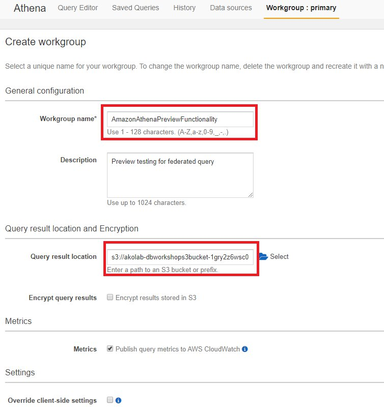

### Switch to the AmazonAthenaPreviewFunctionality workgroup

In the **Workgroups**  panel, choose the **AmazonAthenaPreviewFunctionality** workgroup and then choose  **Switch workgroup**. You will be redirected back to the Athena console. Choose **Get Started** to open the Query Editor again.

 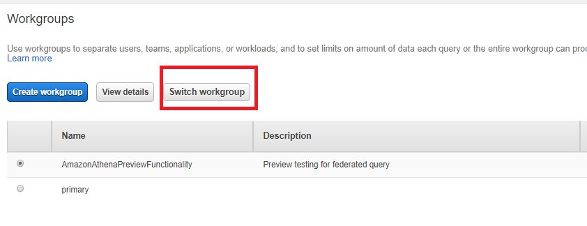

 Now, you are ready to deploy the Athena connectors in your AWS account. To learn more about Athena connectors, please see documentation [connect-to-a-data-source-lambda.html](https://docs.aws.amazon.com/athena/latest/ug/connect-to-a-data-source-lambda.html).

## Setup Athena Connectors and Catalogs

### Setting up Amazon DynamoDB Connector

This connector enables Amazon Athena to communicate with DynamoDB, making the _trips_ tables accessible via SQL. For more information about the connector usage, parameters and limitations, refer to [athena-dynamodb](https://github.com/awslabs/aws-athena-query-federation/tree/master/athena-dynamodb) documentation.

1. Ensure that current AWS region is **US East (N Virginia)**
2. Click on **data sources** tab
3. Click **Connect data source**
4. Select **Query a data source (Beta)**
5. Under choose a data source option, select **Amazon DynamoDB**

 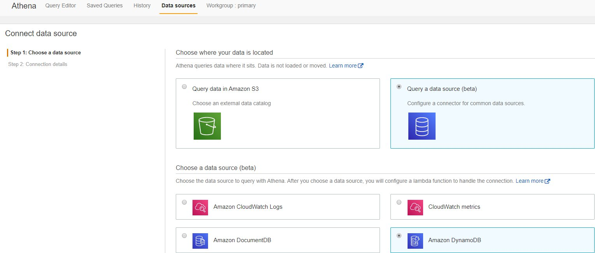

6. Click **Next**
7. In the **Connection details: Amazon DynamoDB** panel, Click **Configure new function**

 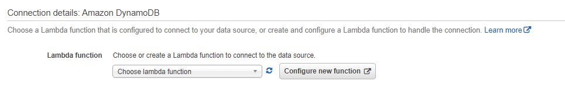

8. You will be be taken to AWS Lambda home page where the connector will be deployed as a SAM Application. Provide values for the following parameters and leave the rest to the default.

   **SpillBucket**: Specify the S3 bucket name that was created as part of the CloudFormation Stack for e.g. mod-aa8afde9acf04c7f-dbworkshops3bucket-1511cfk17lzed
   
   **AthenaCatalogName**: taxiddb
   
   Select the option **_I acknowledge that this app creates custom IAM Roles_** and Click **Deploy**.

 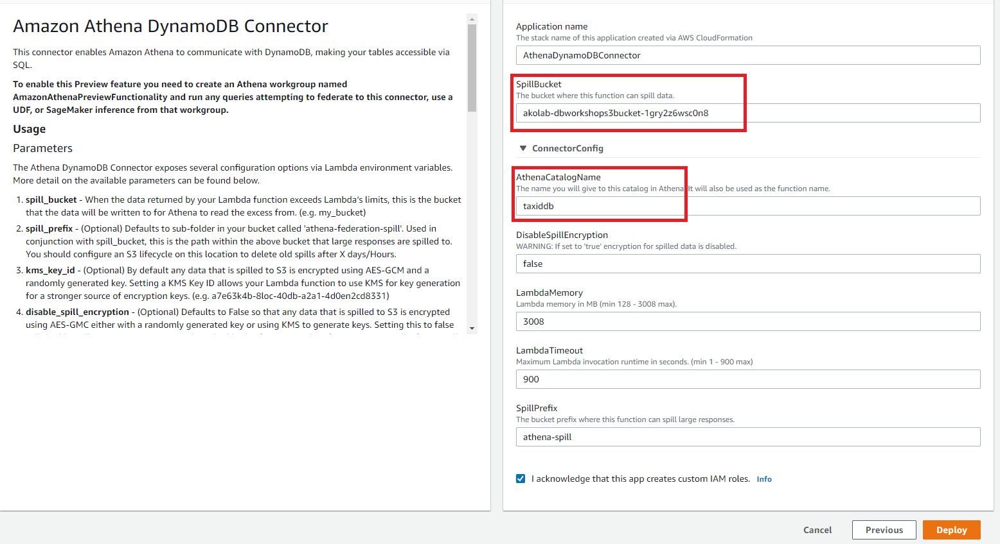
        
>**Note:** It will take a few minutes to deploy. After successful deployment, you can see the Lambda function deployed in your account as shown below.

 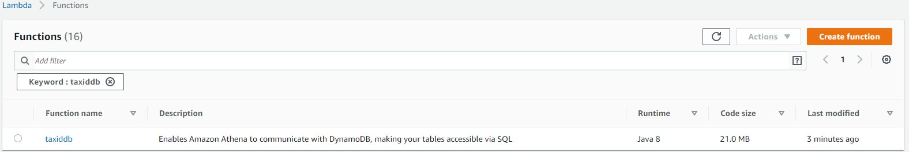

### Setting up catalog for querying DynamoDB

In this step, we will create a catalog named _ddbcatalog_ as shown below.

1. Go Back previous Athena **Data sources** window in your browser and on the **Connection details: Amazon DynamoDB** panel, click the refresh button next to the **Lambda function** input.
2. Choose the Lambda function **taxiddb** and provide a catalog name as **ddbcatalog**.
3. (Optional) Type a description for the Connector for e.g. _catalog to query DDB table via SQL_
4. Click Connect

 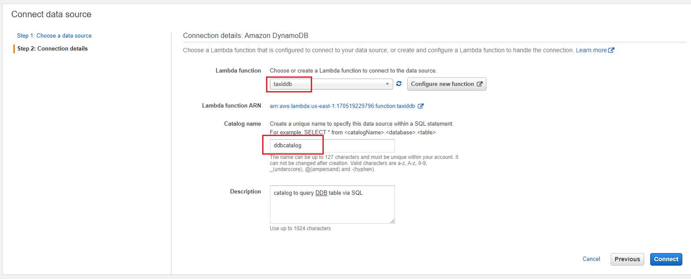

Now, we need to repeat the same process to setup Athena JDBC connector for Aurora PostgreSQL.

### Setting up JDBC connector for Aurora PostgreSQL database

This connector enables Amazon Athena to access your Amazon RDS and Amazon Aurora databases using JDBC driver. For more information about the connector usage, parameters and limitations, refer to [athena-jdbc](https://github.com/awslabs/aws-athena-query-federation/tree/master/athena-jdbc) documentation.

1. Ensure that current AWS region is **US East (N Virginia)**
2. Click on **data sources** tab
3. Click **Connect data source**
4. Select **Query a data source (Beta)**
5. Under choose a data source option, select **PostgreSQL**

 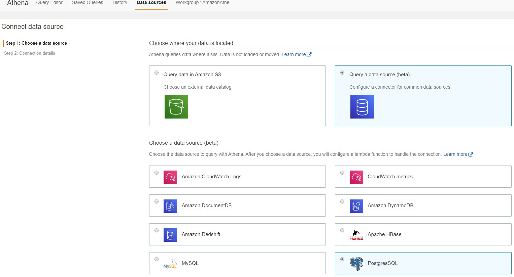

6. Click Next
7. In the **Connection details: PostgreSQL** panel, Click **Configure new function**

 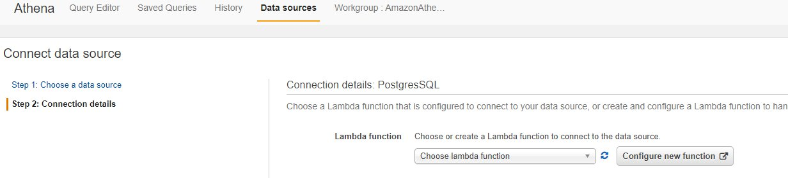

8. You will be taken to AWS Lambda home page where the connector will be deployed as a SAM Application. Provide values for the following parameters and leave the rest to the default.

   **SecretNamePrefix**  : dbadmin

   **SpillBucket**: Specify the S3 bucket name that was created as part of the CloudFormation Stack for e.g. mod-aa8afde9acf04c7f-dbworkshops3bucket-1511cfk17lzed

   **DefaultConnectionString** : postgres://\<AuroraJDBCConnectionString from the output of parent CloudFormation stack\>?user=auradmin&password=auradmin123 for e.g. postgres://jdbc:postgresql://akolab-auroracluster-qlkwnb51f0ir.cluster-ckxdapvbefiz.us-east-1.rds.amazonaws.com:5432/taxidb?user=auradmin&password=auradmin123

   **LambdaFunctionName** : taxirdb

   **SecurityGroupIds** : specify the LambdaSecurityGroupId from the outputs of CloudFormation stack

   **SubnetIds** : specify the LambdaSubnet1,LambdaSubnet2 (separated by commas) from the output of CloudFormation stack
   
   Select the option **_I acknowledge that this app creates custom IAM Roles_** and Click **Deploy**.

>**Note:** The JDBC connector can connect to database using credentials stored in AWS Secrets manager or directly by specifying an userid and password. For this lab, we will specify the userid and password directly in the connection string. We have provided a dummy value as a secretname prefix as this parameter seems to be mandatory.

 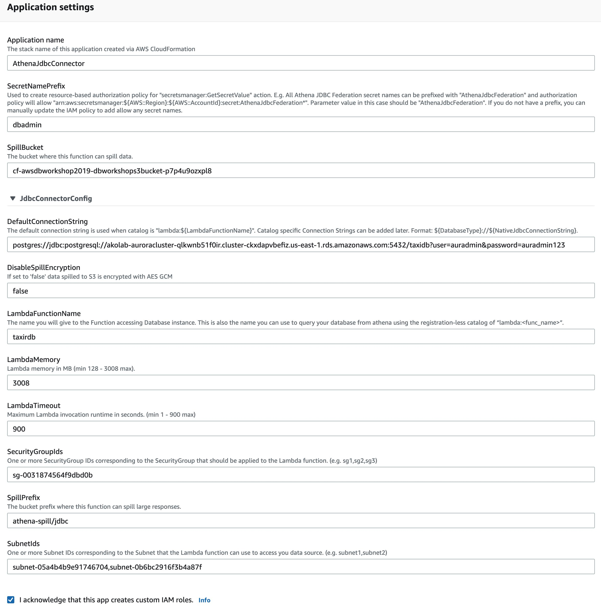

>**Note:** It will take a few minutes to deploy. After successful deployment, you can see the Lambda function deployed in your account as shown below.

 

###  Setting up catalog for querying Aurora PostgreSQL database

In this step, we will create a catalog named rdbcatalog as shown below.

1. Go Back previous Athena **Data sources** window in your browser and on the **Connection details: PostgreSQL** panel, click the refresh button next to the **Lambda function** input.
2. Choose the Lambda function **taxirdb**  and provide a catalog name as **rdbcatalog**.
3. (Optional) Type a description for the Connector
4. Click Connect

Now, we are ready to query both DynamoDB and Aurora PostgreSQL using Athena federated query.

## Query multiple data sources using Athena Federated Query

### Use Case 1 - Querying data from Amazon DynamoDB and Amazon Aurora

In this use case, we will validate data accuracy and consistency for the trip record created as part of Lab 2.

1. Click **Query Editor** tab.
2. In the Athena Query Editor panel, click the banner at the top showing **_set up query result location in Amazon S3_**.

 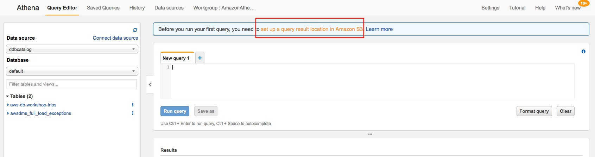

3. Specify the S3 bucket location in the format s3://\<S3bucketName from the output of CloudFormation stack\>/athena/ and click save. For e.g. s://mod-aa8afde9acf04c7f-dbworkshops3bucket-1511cfk17lzed/athena/

 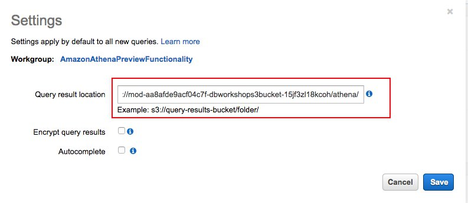

4. Now you can start entering your query in the query pane. Run some sample queries on the Aurora PostgreSQL database. For Aurora, you can directly use the lambda function name as a catalog name.


 ```shell script
/* query to list the databases */
show databases in `lambda:taxirdb`;

/* query to list the tables */
show tables in `lambda:taxirdb`.public

/* query to view the trip records */
select * from "lambda:taxirdb".public.trips_query
 ```

>**Note:** If the **Run Query** button is disabled, click Query Editor tab again or refresh the window.

5. Run some sample queries on DynamoDB either using the catalog name or directly referring the lambda function.

 ```shell script
select * from ddbcatalog.default."aws-db-workshop-trips" where riderid='person69156@example.com'
select * from "lambda:taxiddb".default."aws-db-workshop-trips" where riderid='person69156@example.com'
 ```

6. Run the below query which joins (Inner join) the trip data from Aurora PostgreSQL and DynamoDB tables.  We have used the _riderid_ attribute from DynamoDB to join with _rider\_email_ in trips_query table. _trips\_info_ field is used as an additional join condition. The purpose of the query is to check data consistency of trip data between the two data stores.

 ```shell script
SELECT ddb.riderid,ddb.tripinfo , ddb.fare_amount "DDB-Fareamount", rdb.fare_amount "RDB-Fareamount", ddb.tolls_amount "DDB-Tollsamount", rdb.tolls_amount "RDB-Tollsamount", ddb.passenger_count "DDB-passenger_count", rdb.passenger_count "RDB-passenger_count", ddb.tip_amount "DDB-Tipamount", rdb.tip_amount "RDB-Tipamount",  ddb.total_amount "DDB-Totalamount", rdb.total_amount "RDB-Totalamount"
FROM
ddbcatalog.default."aws-db-workshop-trips" ddb,
"lambda:taxirdb".public.trips_query rdb
where 
ddb.riderid=rdb.rider_email
and ddb.tripinfo=rdb.trip_info
 ```

### Use Case 2 - Querying data from Amazon DynamoDB and Amazon S3

In this example, we will perform an adhoc analytics to get the trends on total rides,number of rides per vendor, along with the average fair amount for Green taxi rides.  We will use trip data from the [NY taxi public dataset](https://registry.opendata.aws/nyc-tlc-trip-records-pds/) for this illustration.

1. Choose the datasource as "**awsdatacatalog**" and create an external table to refer the already saved NY taxi dataset in AWS S3.

 ```shell script
CREATE DATABASE athenataxidb;

CREATE EXTERNAL TABLE IF NOT EXISTS taxigreen (
      VendorID STRING,
      tpep_pickup_datetime TIMESTAMP,
      tpep_dropoff_datetime TIMESTAMP,
      passenger_count INT,
      trip_distance DOUBLE,
      pickup_longitude DOUBLE,
      pickup_latitude DOUBLE,
      RatecodeID INT,
      store_and_fwd_flag STRING,
      dropoff_longitude DOUBLE,
      dropoff_latitude DOUBLE,
      payment_type INT,
      fare_amount DOUBLE,
      extra DOUBLE,
      mta_tax DOUBLE,
      tip_amount DOUBLE,
      tolls_amount DOUBLE,
      improvement_surcharge DOUBLE,
      total_amount DOUBLE
    )
    ROW FORMAT DELIMITED FIELDS TERMINATED BY ','
    STORED AS TEXTFILE
    LOCATION 's3://us-east-1.data-analytics/NYC-Pub/green/'
 ```

2 . Now you can query both historical as well as current dataset in DynamoDB using federated query.  The below query shows the trend on riders and average amount between two data sets for each vendor.

>**Note:** If you get an internal service error, please run the query again.

 ```shell script
with s3history as (SELECT 
    CASE vendorid 
         WHEN '1' THEN 1
         WHEN '2' THEN 2
         ELSE 2 END AS Vendor,
    COUNT(1) as RideCount, 
    sum(total_amount)  as TotalAmount,
    avg(total_amount) as AverageAmount
    FROM Taxigreen
    WHERE total_amount > 0
    GROUP BY (1)),
    ddbcurrent as  (  SELECT 
  vendor_id,
  count(*) as RideCount,
   sum(total_amount)  as TotalAmount,
   avg(total_amount) as AverageAmount
   FROM   ddbcatalog.default."aws-db-workshop-trips" ddb
   where ddb.total_amount > 0
   GROUP BY vendor_id)
SELECT s3history.Vendor,
ddbcurrent.TotalAmount, s3history.TotalAmount "Hist-TotalAmount",   
ddbcurrent.AverageAmount, s3history.AverageAmount "Hist-AverageAmount",
ddbcurrent.RideCount, s3history.RideCount "Hist-RideCount"
FROM s3history
JOIN ddbcurrent ON s3history.vendor = ddbcurrent.vendor_id;
 ```

### Use Case 3 - Querying data from Amazon DynamoDB and partitioned data in Amazon S3

By partitioning your data, you can restrict the amount of data scanned by each query, thus improving performance and reducing cost. Athena leverages Hive for [partitioning](https://cwiki.apache.org/confluence/display/Hive/LanguageManual+DDL#LanguageManualDDL-AlterPartition) data. You can partition your data by any key. A common practice is to partition the data based on time, often leading to a multi-level partitioning scheme. For example, a customer who has data coming in every hour might decide to partition by year, month, date, and hour. Another customer, who has data coming from many different sources but loaded one time per day, may partition by a data source identifier and date.

1. In the query pane, paste the following statement to create the NYTaxiRides table, and then choose **Run Query**.

 ```shell script
CREATE EXTERNAL TABLE NYTaxiRides (
    vendorid STRING,
    pickup_datetime TIMESTAMP,
    dropoff_datetime TIMESTAMP,
    ratecode INT,
    passenger_count INT,
    trip_distance DOUBLE,
    fare_amount DOUBLE,
    total_amount DOUBLE,
    payment_type INT
    )
  PARTITIONED BY (YEAR INT, MONTH INT, TYPE string)
  STORED AS PARQUET
  LOCATION 's3://us-east-1.data-analytics/canonical/NY-Pub';
  
-- Load partitions

  MSCK REPAIR TABLE nytaxirides;
  ```

   This will create a table partitioned by year,month and type. The files are already created and stored in parquet format in AWS S3.

2. Now we will perform month-wise comparison of 2016 DynamoDB data with previous year (2015) data stored in AWS S3. This is helpful in a scenario where you wish to perform trend analysis on hot data stored in DynamoDB and cold data stored in AWS S3.

>**Note:** If you get an internal service error please run the query again.

 ```shell script
with s3history AS 
    (SELECT YEAR,
        month,
        CASE vendorid
        WHEN '1' THEN
        1
        WHEN '2' THEN
        2
        ELSE 2
        END AS Vendor, COUNT(1) AS RideCount, sum(total_amount) AS TotalAmount, avg(total_amount) AS AverageAmount
    FROM NYTaxiRides
    WHERE total_amount > 0
    GROUP BY  (1),(2),(3)), ddbdata AS 
    (SELECT vendor_id,
        extract(year
    FROM date_parse(pickup_datetime,'%Y-%m-%dT%H:%i:%sZ')) AS year, extract(month
    FROM date_parse(pickup_datetime,'%Y-%m-%dT%H:%i:%sZ')) AS month,total_amount
    FROM ddbcatalog.default."aws-db-workshop-trips" ddb
    WHERE ddb.total_amount > 0 ), ddbcurrent AS 
    (SELECT year,
        month,
        vendor_id,count(1) as ridecount,
        sum(total_amount) AS TotalAmount,
         avg(total_amount) AS AverageAmount
    FROM ddbdata
    GROUP BY  year,month,vendor_id)
SELECT s3history.YEAR,s3history.month,
         s3history.Vendor,
         ddbcurrent.TotalAmount,
         s3history.TotalAmount "Hist-TotalAmount",
         ddbcurrent.AverageAmount,
         s3history.AverageAmount "Hist-AverageAmount",
         ddbcurrent.RideCount,
         s3history.RideCount "Hist-RideCount"
FROM s3history
JOIN ddbcurrent
    ON s3history.vendor = ddbcurrent.vendor_id
        AND s3history.month=ddbcurrent.month
WHERE s3history.YEAR = 2015
and ddbcurrent.year=2016;
 ```
 

 **Congrats!!** You have successfully completed Lab 3. This concludes the workshop Labs.